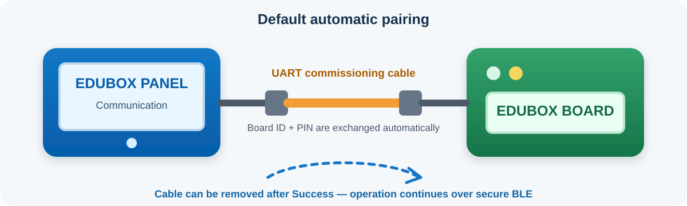

# BLE bridge: použití a commissioning

Tento dokument popisuje BLE transport mezi **EduBox HUB Boardem** (BLE peripheral) a Panelem (BLE central). BLE je další transport VSCP vedle USB a UART2; nenahrazuje je ani je při startu automaticky nevypíná.

## První spojení

Panel může s deskou EduBox komunikovat přes zabezpečené Bluetooth LE. Deska a
Panel se spárují jednou; Panel si pak ověřenou desku zapamatuje a při dalších
relacích se k ní automaticky znovu připojí. Ve třídě s více deskami a Panely
vždy porovnejte **Board ID zobrazené na Panelu s ID vytištěným na štítku desky**.

### Doporučeno: automatické párování pomocí kabelu



Jde o výchozí a doporučený způsob uvedení do provozu. Kabel slouží pouze
k identifikaci a autorizaci správné desky. Po spárování běžná komunikace přejde
na Bluetooth, takže kabel lze odpojit, jakmile se zobrazí obrazovka úspěšného
dokončení.

1. Zapněte **Panel** a **desku**.
2. Na Panelu otevřete **Communication** a klepněte na **Wireless (BLE)**.
3. Pokud si Panel nepamatuje žádnou desku, vyzve vás k připojení kabelem. Propojte
   desku přímo s Panelem pomocí UART kabelu pro uvedení do provozu.
4. Počkejte, než Panel načte Board ID a PIN, vyhledá právě tuto desku a dokončí
   bezpečné Bluetooth párování. PIN není třeba zadávat.
5. Po zobrazení **Success!** odpojte kabel pro uvedení do provozu a klepněte na
   **Continue**.

Panel si desku zapamatuje. Při dalších použitích klepnutím na **Wireless (BLE)**
automaticky spustíte Bluetooth připojení a zobrazí se ukazatel průběhu.

Pokud je připojená deska už spárovaná s jiným Panelem, po výzvě zvolte
**Forget Board & replace pairing**. Během odstraňování předchozího párování
z obou zařízení ponechte kabel připojený.

### Ruční párování pomocí Board ID a PINu

Ruční párování použijte, pokud nemáte kabel pro uvedení do provozu. Deska nesmí
být spárovaná a musí vysílat během párovacího okna. Přesné **Board ID** a
šestimístný **PIN** jsou vytištěny na štítku desky; při spuštění se také zapisují
do jejího UART logu.

1. Zapněte desku a umístěte ji blízko Panelu. Pokud párovací okno nespárované
   desky vypršelo, desku restartujte.
2. Na Panelu otevřete **Communication**.
3. Klepněte na malé tlačítko **settings (gear)** vedle položky **Wireless (BLE)**.
4. Počkejte na dokončení vyhledávání. V případě potřeby klepněte znovu na **Scan**.
5. Otevřete rozbalovací nabídku desek a vyberte položku, jejíž Board ID přesně
   odpovídá ID na fyzickém štítku.
6. Klepněte na zelené tlačítko **Connect**.
7. Zadejte šestimístný PIN do plovoucího dialogu a potvrďte ho potvrzovací
   klávesou klávesnice.
8. Počkejte na **Success!** a pak klepněte na **Continue**.

Pokud je párování už uloženo, tlačítko **Connect** je neaktivní a **Forget
pairing** je aktivní. Pokud žádné párování uloženo není, platí to naopak. Po
vyhledání se zapamatovaná deska automaticky vybere, pokud je dostupná.

### Zapomenutí nebo nahrazení párování

Informace o párování jsou uloženy v Panelu i v desce, a proto je nutné je
odstranit z obou zařízení. Smazání záznamu pouze v Panelu by ponechalo desku
svázanou s předchozím protějškem.

1. Otevřete **Communication** a klepněte na tlačítko **settings (gear)** vedle
   položky **Wireless (BLE)**.
2. Propojte spárovanou desku přímo s Panelem pomocí UART kabelu pro uvedení do
   provozu a ujistěte se, že je deska zapnutá.
3. Klepněte na červené tlačítko **Forget pairing** v pravém dolním rohu.
4. Počkejte, až Panel potvrdí odstranění párování z desky i z Panelu.
5. Vraťte se do BLE Settings a znovu spusťte vyhledávání a párování, nebo
   obrazovku zavřete.

### Řešení potíží s Bluetooth

| Zpráva nebo příznak | Co zkontrolovat |
| --- | --- |
| `No PAIR response in 5 seconds` | Zkontrolujte napájení desky a přímé UART propojení pro uvedení do provozu, včetně vodičů TX, RX a GND. Znovu připojte kabel a klepněte na **Retry**. |
| `This Board is already paired` | Ponechte kabel připojený a zvolte **Forget Board & replace pairing**, případně akci zrušte, pokud má stávající párování zůstat zachováno. |
| Deska se při vyhledávání nenajde podle Board ID | Ověřte, že je deska zapnutá, poblíž a vysílá. Porovnejte ID v nabídce se štítkem, potom nespárovanou desku restartujte a znovu klepněte na **Scan**. |
| `Pairing failed: check PIN / BOOT reset` | Ověřte všech šest číslic PINu podle štítku desky nebo jejího UART logu při spuštění. Pokud je to možné, upřednostněte automatické párování kabelem. |
| **Connect** je neaktivní | Panel si už desku pamatuje. Použijte běžné tlačítko **Wireless (BLE)** nebo nejprve odeberte staré párování pomocí **Forget pairing**. |
| **Forget pairing** je neaktivní | Panel si žádnou desku nepamatuje, takže v něm není místní párování k odstranění. |
| `Remembered Board is unavailable` | Zkontrolujte, že je spárovaná deska zapnutá a v dosahu. Pokud má být tento Panel přiřazen k jiné desce, použijte postup zapomenutí párování kabelem. |
| Zapomenutí nebo nahrazení párování selže | Vypněte a znovu zapněte desku, znovu připojte UART kabel pro uvedení do provozu a akci opakujte. Ověřte, že jde o desku, jejíž ID je uloženo v Panelu. Pokud problém přetrvá, podržte tlačítko **BOOT** na desce alespoň 3 sekundy a potom kabelem znovu spusťte **Forget pairing**, aby se odstranil i záznam v Panelu. |

Párování Bluetooth používá ověřené Secure Connections. Není k dispozici
nezabezpečená záložní možnost staršího párování a Panel po úspěšném spárování
šestimístný PIN pro uvedení do provozu nikdy neukládá.

## Co je potřeba

- Firmware musí být sestaven s `EDUBOX_BLE_ENABLED=1` (výchozí hodnota v `src/BoardConfig.hpp`).
- Board a Panel musí používat stejnou verzi BLE knihovny a profil `EDUBOX-BLE/1`.
- Pro commissioning musí být Board fyzicky připojen přes **UART2** k autorizovanému nástroji/Panelu. UART0/USB pro tento krok oprávněný není.
- První pairing musí proběhnout do 120 s po bootu nepřiřazeného Boardu, nebo do 120 s od úspěšného příkazu `PAIR`. Délku okna určuje `blePairingWindowMs`.

V aktuální konfiguraci je UART2: 115200 Bd, 8N1, RX GPIO18 a TX GPIO17.

## Co se děje pod kapotou

1. Zapněte Board a připojte autorizovaný Panel/nástroj k UART2.
2. Před `INIT` pošlete přes UART2 VSCP požadavek `PAIR`:

   ```text
   ?type=PAIR
   ```

   Odpověď se `status=1` obsahuje `board_id` a šestimístný `pin`, například:

   ```text
   ?board_id=EB-1234-89ABCDEF&pin=123456&seq=1&status=1
   ```

   `seq` je transakční číslo; jeho konkrétní hodnota není pevně daná. PIN ani celou odpověď neukládejte do sdílených logů.
3. Na Panelu spusťte BLE scan, vyberte inzerovaný Board se stejným `board_id` a zadejte vrácený PIN.
4. Vyčkejte na dokončení bezpečného párování. Panel ověří šifrování, MITM autentizaci, bond a 16bajtový klíč; teprve pak uloží ověřenou BLE identitu a Board ID.
5. Panel čeká, až Board zpřístupní stav `EDUBOX-BLE/1;ready=1`. Až potom smí přes BLE poslat VSCP `INIT` a běžné `CONNECT`, `CONFIG`, `UPDATE` nebo `CONTROL` příkazy.

Po úspěchu je Board pro daný Panel spárován. Další `PAIR` bez resetu vrátí `already_paired` a běžný návrat Panelu používá uložený bond bez PINu.

## Výměna Panelu nebo nové spárování

Z bezpečnostních důvodů nelze přidat druhý Panel bez explicitního zrušení stávajícího bondu. Použijte jednu z následujících fyzicky autorizovaných cest.

### Reset přes UART2

Připojte autorizovaný nástroj k UART2 a před `INIT` odešlete:

```text
?type=PAIR&reset=1
```

Board ukončí BLE relaci, zastaví její řídicí session, smaže bond, znovu otevře commissioning window a vrátí pár `board_id`/`pin`. Poté proveďte postup prvního uvedení do provozu. Pokud se reset nezdaří, vrátí se `pairing_reset_failed`.

### Lokální reset tlačítkem BOOT

Po **normálním dokončení bootu** podržte tlačítko **BOOT (GPIO0)** nejméně 3 sekundy. Firmware zastaví všechny transportní řídicí session a výstupy, smaže BLE bond a restartuje Board do commissioning režimu. Tlačítko nepoužívejte jen k otevření sériového portu při programování; uvedený reset se vyhodnocuje až za běhu firmware.

Po resetu odeberte starý bond také z nastavení Bluetooth původního Panelu, pak znovu spárujte požadovaný Panel. Jinak se může pokoušet o připojení se zastaralým klíčem.

## Běžné používání

- Board inzeruje své jméno jako `board_id` ve formátu `EB-XXXX-XXXXXXXX`. Stejné ID musí být na fyzickém štítku, v UI Panelu i v reklamě BLE.
- Je povoleno pouze jedno BLE spojení. Druhý klient je odmítnut.
- Uložený Panel se může připojit automaticky, ale jen přes uloženou a po autentizaci ověřenou identitu. Automatický reconnect nikdy nezadává PIN ani nepřijímá numeric-comparison pairing.
- Po odpojení, chybě protokolu nebo timeoutu Board ukončí BLE session a uvolní řízení zařízení. Opětovné připojení neobnovuje staré `INIT`, nastavení ani příkazy `CONTROL`; Panel musí vytvořit novou VSCP session.
- `writeLine()` znamená pouze zařazení zprávy k odeslání, ne potvrzené doručení ani vykonání akce. Protokol používá potvrzené BLE indications.

## Diagnostika a řešení potíží

Na UART0/USB-UART (115200 Bd) firmware při startu vypisuje například Board ID, PIN a dobu pairing window. Tento výpis je určen jen pro lokální commissioning; PIN považujte za citlivý. Bližší popis logů je v [UART_DEBUG.md](dev/UART_DEBUG.md).

| Projev | Kontrola / náprava |
| --- | --- |
| Board není ve scanu | Ověřte, že je BLE povoleno a že Board není už spojen s jiným klientem. U nepřiřazeného Boardu otevřete commissioning přes UART2 `PAIR` nebo po bootu jednejte do 120 s. |
| `PAIR requires Board UART` | Požadavek přišel z USB/UART0 nebo BLE. Připojte se na UART2. |
| `already_paired` | Board už má bond. Pro plánovanou výměnu použijte `?type=PAIR&reset=1` přes UART2 nebo BOOT na 3 s. |
| Pairing selže | Zkontrolujte shodu Board ID, čerstvý šestimístný PIN a otevřené commissioning okno. Při neznámém stavu proveďte lokální reset bondu. |
| Panel hlásí „Saved bond missing“ nebo „Bonded Board identity mismatch“ | Nesnažte se o automatické připojení; proveďte ruční commissioning s PINem. |
| Připojení vznikne, ale VSCP nefunguje | Panel musí odebírat TX indications a vyčkat `ready=1` před `INIT`. Po každém reconnectu proveďte nový `INIT`. |

## Rozhraní BLE a provozní limity

Použitý GATT profil má service UUID `ecb00001-8b65-4f41-9f17-6a672d8ad701` a charakteristiky RX `...0002`, TX `...0003`, Status `...0004` (úplné UUID jsou v `libraries/edubox-ble/src/ble_channel.hpp`). RX přijímá autentizovaný šifrovaný zápis s odpovědí, TX používá potvrzené indications a Status je autentizovaně/šifrovaně čitelný.

VSCP řádky jsou přenášeny ve fragmentech s maximálně 1024 znaky na zprávu. Čekání na další fragment trvá nejvýše 5 s a potvrzení indication nejvýše 2 s. Neplatné, neúplné, příliš dlouhé nebo neuspořádané zprávy linku uzavřou; nikdy nejsou předány do VSCP. Rádio a fyzické výstupy je nutné ověřit na skutečném hardware, protože nativní testy pokrývají jen framing a VSCP integraci.

## Bezpečnostní pravidla

- PIN si vyžádejte jen lokálně autorizovanou cestou `PAIR` na UART2. Neexistuje vzdálený BLE příkaz pro vyčtení nebo reset bondu.
- PIN je šest číslic a firmware jej určuje z Board ID a lokálního klíče. Neměňte `EDUBOX_BLE_PAIRING_KEY` jen na jedné straně systému, jinak nebude provozní postup konzistentní.
- BLE adresa sama o sobě není autentizace. Důvěřujte až úspěšnému šifrovanému, autentizovanému a uloženému bondu.
- Neobcházejte požadavek na Secure Connections, MITM, bonding a 16bajtový šifrovací klíč. Tyto vlastnosti jsou součástí profilu Boardu i Panelu.

Technické detaily rámování a implementační kontrakt knihovny jsou v [`libraries/edubox-ble/README.md`](../libraries/edubox-ble/README.md).
